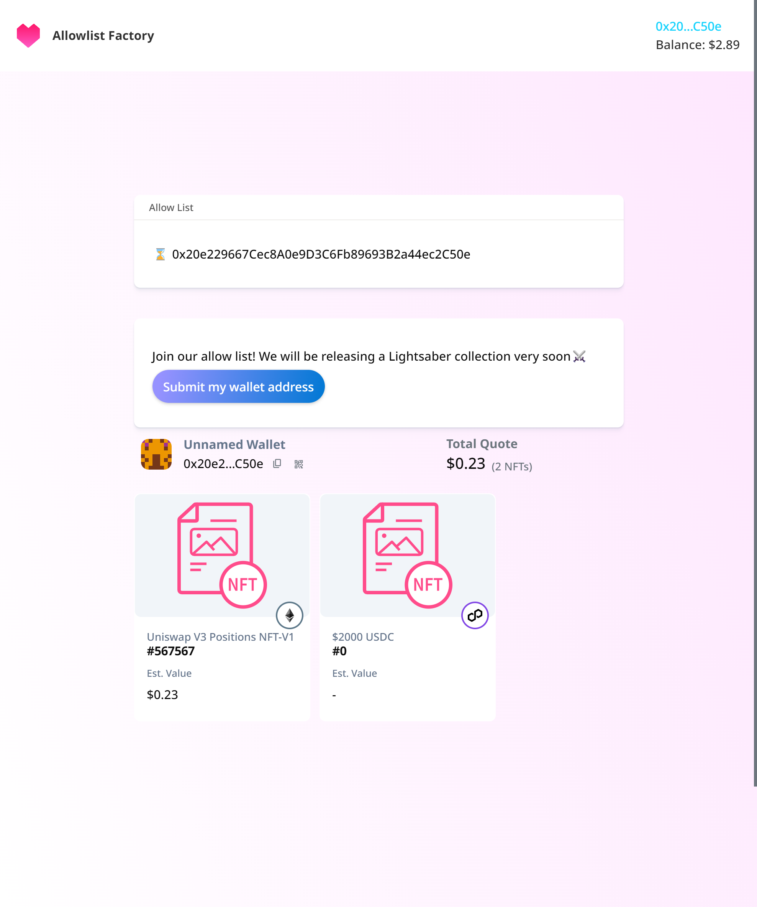

# 🛡️Allow List Factory
---


## Overview
✨ This <span style="color:cyan">smart contract</span> provides a secure and transparent way to manage whitelist access for minting NFTs by using **<span style="color:gold">Unified API</span>** & **<span style="color:gold">GoldRush Kit.</span>**

### Advantages

**Fair and secure NFT distribution:** Prioritize specific users (e.g., early supporters, community members) by granting them exclusive access to mint NFTs before the public sale.

**Reduce gas fee:** Reduce transaction fees by limiting initial minting to whitelisted addresses.

**Increase community engagement:** Encourage participation in community activities or social media engagement as criteria for whitelisting.

**Transparency and immutability:** All whitelist data is stored on the blockchain, ensuring tamper-proof records and open visibility.

### Contract Address 
[Ethereum Sepolia](https://sepolia.etherscan.io/address/0xa5e73b15c1c3ee477aed682741f0324c6787bbb8):
```
0xa5e73b15c1c3ee477aed682741f0324c6787bbb8
```

### Getting Started
```
git clone https://github.com/web3senior/allowlist-factory
```
```
cd allowlist-factory
```
```
npm i
```
```
npm run dev
```

➜ ready on localhost💥

### Screenshot


### Demo
### [view demo]()


### License
---
Distributed under the MIT License.

[Amir Rahimi](https://universallink.me/u/atenyun) - Fullstack blockchain developer